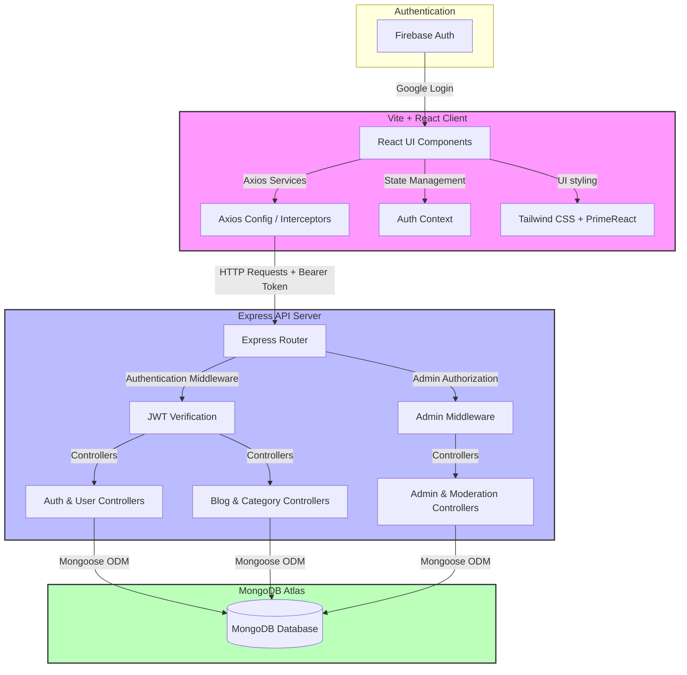

# ✍️ Blogging Platform - Modern MERN Stack Application

[](#-deployment-guide)
[](#)
[](#)
[](#)

A production-ready, feature-rich Blogging Platform built using the **MERN** stack (MongoDB, Express, React, Node.js). Designed with a modern dark-mode enabled interface, it features role-based access control, a rich-text WYSIWYG editor, full-featured user/blog administration boards, and interactive analytics.

---

## 💼 Recruiter Quick Access (One-Click Demo)

To make review as simple as possible, the application includes a **Recruiter Quick Access** widget directly on the Sign-In page. Clicking either button will instantly log you into a fully seeded environment.

| Role | Demo Username | Demo Password | Purpose |
| :--- | :--- | :--- | :--- |
| **System Administrator** | `admin@demo.com` | `password123` | Moderate reports, manage users, and view platform traffic analytics. |
| **Author User** | `author@demo.com` | `password123` | Draft, preview, publish blogs, like posts, and edit profile settings. |

---

## 🏗️ System Architecture

This project is built using a decoupled client-server architecture designed for easy scaling and clean separation of concerns.



---

## ✨ Core Features

*   **🎭 Role-Based Portals**: Clean separation of dashboard views for normal Users/Authors (Explore feed, blog creator, personal profile) and Administrators (user tables, traffic statistics, flag queues).
*   **📝 WYSIWYG Blog Editor**: Formatted writing experience using the **PrimeReact Editor** (Quill core) supporting text formatting, bullet lists, custom headers, and cover image uploads.
*   **📊 Traffic & Engagement Charts**: Visual statistics built with **ChartJS** showing hourly user activity metrics and blog counts per user.
*   **🛡️ Content Moderation & Reporting**: Integrated flag/report pipelines allowing readers to flag inappropriate content, sending it directly to the admin moderation dashboard.
*   **👍 Like & Dislike Engine**: High-performance voting index preventing double-voting and generating engagement metrics.
*   **🌓 Sleek Tailwind Dark Mode**: Fully responsive, curated HSL color styling with smooth transition theme toggles.

---

## 🚀 Getting Started (Local Development)

### 📋 Prerequisites

*   [Node.js](https://nodejs.org/en/) (v18.x recommended)
*   [MongoDB](https://www.mongodb.com/try/download/community) (Local instance or MongoDB Atlas Connection String)
*   [Docker Desktop](https://www.docker.com/products/docker-desktop/) (Optional, for running via containers)

### 🐋 Method 1: Using Docker Compose (Fastest)

1. Clone the repository and navigate to the project directory:
   ```bash
   git clone https://github.com/Harsh12bhardwaj/Blogging-Platform-main.git
   cd Blogging-Platform-main
   ```
2. Build and start all services (Client, API Server, MongoDB local instance):
   ```bash
   docker-compose up --build -d
   ```
3. Open `http://localhost:5173` in your browser. The database will automatically initialize and auto-seed!

### 💻 Method 2: Manual Local Installation

#### 1. Setup Backend Server
1. Navigate to the server folder:
   ```bash
   cd server
   ```
2. Install dependencies:
   ```bash
   npm install
   ```
3. Create a `.env` file in the `server` directory and add your configurations:
   ```env
   PORT=5500
   MONGODB_URI=mongodb://localhost:27017/blogging-platform
   JWT_SECRET=supersecretkey
   ```
4. Run the seed script to pre-fill the database:
   ```bash
   npm run seed
   ```
5. Start the backend developer server:
   ```bash
   npm run dev
   ```

#### 2. Setup Frontend Client
1. Navigate to the client folder in a new terminal window:
   ```bash
   cd client
   ```
2. Install dependencies:
   ```bash
   npm install
   ```
3. Create a `.env` file in the `client` directory and specify the API base URL:
   ```env
   VITE_BASE_URL=http://localhost:5500
   ```
4. Run the client development server:
   ```bash
   npm run dev
   ```
5. Open `http://localhost:5173` to explore the application.

---

## ☁️ Deployment Guide (Vercel & Render)

This application is designed to be easily deployed onto cloud platforms.

### 🌐 Backend Deployment (e.g., Render, Railway, or Vercel Serverless)

1. Create a new service on your backend host pointing to the `/server` directory of this repository.
2. Configure the following environment variables:
   *   `MONGODB_URI`: Your MongoDB Atlas Connection String.
   *   `JWT_SECRET`: A strong random string for signing JWT tokens.
3. Set the start command to:
   ```bash
   npm start
   ```

### 🖥️ Frontend Deployment (Vercel)

The root folder of this project contains configuration files structured for instant Vercel monorepo detection.

1. Import the repository into your Vercel Dashboard.
2. Choose **Vite** as the framework preset.
3. Configure the Root Directory as `client`.
4. Add the environment variable:
   *   `VITE_BASE_URL`: The deployed URL of your backend service (e.g., `https://blogging-platform-api.onrender.com`).
5. Click **Deploy**. Vercel will build the frontend and serve it globally with edge caching.
